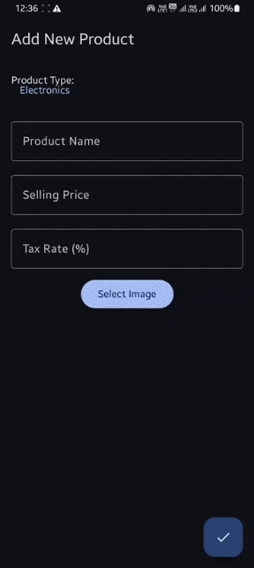

# Swipe Assignment - MVVM Architecture with Offline Support

## Overview

This project demonstrates the implementation of the **Model-View-ViewModel (MVVM)** architecture using **Jetpack Compose** in an Android application. The app supports offline functionality by integrating **Room Database** for local storage and **Retrofit** for network communication.

## Features

- **MVVM Architecture**: Clean separation of concerns between the UI, business logic, and data layer.
- **Offline Support**: Caching products in a Room database when the device is offline, with data sync from the network when online.
- **Dependency Injection**: Using **Hilt** for dependency injection to manage dependencies like API service, Room database, and repository.

## Architecture Components

- **Model**: Handles data fetching and storage (network and local).
- **View**: Jetpack Compose UI elements that display product data.
- **ViewModel**: Manages UI-related data, performs business logic, and communicates between the Model and View.


### Notes:
- The GIF is referenced using 


## Dependencies

- **Hilt**: For dependency injection.
- **Retrofit**: For network requests to the API.
- **Room**: For local database to store product data offline.

## How It Works

1. **ProductRepo**: A repository that manages both network calls and local database operations.
2. **ProductViewModel**: The ViewModel that interacts with the repository and prepares data for the UI.
3. **Offline Handling**: If the device is offline, the app fetches product data from the local database; if online, it fetches data from the network and updates the local storage.

## Setup

1. Clone the repository:
   ```bash
   git clone https://github.com/joni/Assignment.git
